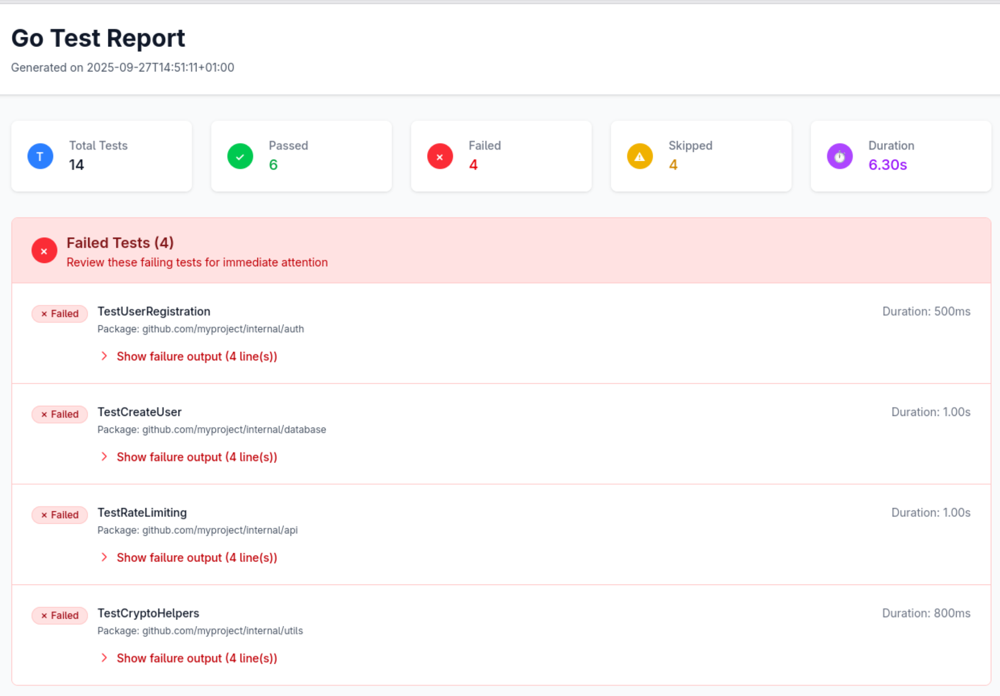

# go-test-html-report

> A Golang library for generating HTML reports from go test results.

<div align="center">


[](https://goreportcard.com/report/github.com/brpaz/go-test-html-report)
[](https://github.com/brpaz/go-test-html-report/actions)
[](https://github.com/brpaz/go-test-html-report/blob/main/LICENSE)

</div>


## 🖼️ Example



You can find a full page screenshot of the resulting report [here](./docs/assets/images/screenshot-full.png) and a full HTML example [here](./example/test-report.html).

## 🚀 Getting Started

### Installation

**Binary install**

The simplest way to install this tool is by using the binary release. See [Releases](https://github.com/brpaz/go-test-html-report/releases) for details.

**Go install**

```bash
go install github.com/brpaz/go-test-html-report/cmd/go-test-html-report@latest
```

**Nix**

TBD

## 🔧 Usage

After installing `go-test-html-report`, you can use it to generate an HTML report from your Go test results.

The tool supports reading test results from a JSON file or directly from standard input.

**From file**

```bash
go-test-html-report -i path/to/test-results.json -o path/to/report.html -t "Test Report"
```
**From standard input**

```bash
go test -json ./... | go-test-html-report -i - -o path/to/report.html -t "Test Report"
```

### Command flags

| Flag        | Short | Description                                               | Default Value       |
| ----------- | ----- | --------------------------------------------------------- | ------------------- |
| `--input`   | `-i`  | Input file containing Go test results (use '-' for stdin) | `test_results.json` |
| `--output`  | `-o`  | Output file for the HTML report                           | `report.html`       |
| `--title`   | `-t`  | Title for the HTML report                                 | `Go Test Report`    |
| `--help`    | `-h`  | Show help information                                     | -                   |
| `--version` | `-v`  | Show version information                                  | -                   |


## 🤝 Contributing

Contributions are welcome! If you find a bug or have a feature request, please open an issue or submit a pull request.

## 🫶 Support

If you find this project helpful and would like to support its development, there are a few ways you can contribute:

[](https://github.com/sponsors/brpaz)

<a href="https://www.buymeacoffee.com/Z1Bu6asGV" target="_blank"></a>

## 📩 Contact

✉️ **Email** - [oss@brunopaz.dev](oss@brunopaz.dev)

🖇️ **Source code**: [(https://github.com/brpaz/go-test-html-report)](https://github.com/brpaz/go-test-html-report)

## 📃 License

Distributed under the MIT License. See [LICENSE](LICENSE) file for details.
